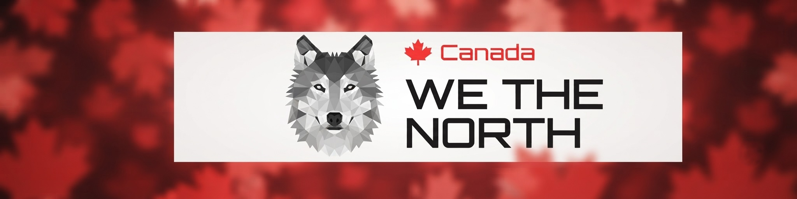

  

**To access this market, use the Tor browser - https://www.torproject.org/download/**

**Market link - http://hn2pawftru6xs3e2fokgwx6ts67cjroadhnphaou7rzgezntkklcv6yd.onion**

# We The North — A Regional Darknet Marketplace

**We The North**, commonly shortened to **WTN**, was a Canada-oriented darknet marketplace that became known in the early 2020s.

What set it apart was its regional character. While many darknet markets aimed for an international audience, WTN built its identity around a specifically Canadian community.

## 🇨🇦 A Marketplace With a Local Identity

The name **We The North** was central to the platform's branding.

It immediately connected the marketplace with Canada and gave it a recognizable identity within an otherwise largely anonymous environment.

The use of English and French also reflected the country's linguistic landscape and reinforced the platform's regional positioning.

## 👤 Identity Through Usernames

WTN operated around pseudonymous accounts.

Users were represented by usernames rather than publicly identifiable profiles. Over time, activity, feedback, and interactions could accumulate around an account, giving it a recognizable history.

This created an interesting distinction:

> **The person could remain anonymous while the account developed its own identity.**

For a pseudonymous community, that continuity is important.

## ⭐ Reputation Over Recognition

Without conventional public identities, reputation becomes a useful source of context.

Reviews and account history allowed participants to distinguish between established and unfamiliar profiles. A username with a long history could carry more recognition within the community than a newly created account.

Reputation was therefore built through participation rather than personal disclosure.

## 🧩 More Than a Catalog

WTN combined marketplace functions with community-oriented features.

The platform included familiar elements such as:

* **Categories**
* **Listings**
* **Seller profiles**
* **Reviews**
* **Internal messaging**
* **Discussion features**

This created a structure that resembled a combination of an online marketplace and a community platform.

## 🌐 What Made WTN Interesting

The distinctive feature of WTN was the combination of **regional identity and anonymity**.

Its Canadian focus showed that even pseudonymous communities can develop a strong sense of place and shared identity.

The platform's name, language, user profiles, and community features all contributed to that character.

## Final Perspective

We The North represents a specific moment in the evolution of darknet marketplaces, when regional platforms could develop their own recognizable identities alongside the broader anonymous ecosystem.

Its model can be summarized simply:

**🇨🇦 Regional focus**
**👤 Pseudonymous identity**
**⭐ Internal reputation**
**🧩 Community structure**

That combination made WTN a distinctive example of how anonymous online marketplaces could develop a recognizable culture of their own.
